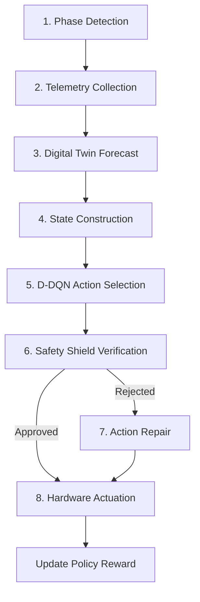

# Thermo-LLM: Phase-Aware Physics-Informed Reinforcement Learning for Sustainable Edge LLM Inference

Thermo-LLM is a proactive, neuro-symbolic thermal management framework designed for running Large Language Models (LLMs) sustainably on resource-constrained edge SoCs (such as the Broadcom BCM2712/Raspberry Pi 5 and Snapdragon 8 Gen 3/S24 Ultra). Standard edge thermal governors are entirely reactive, leading to severe thermal throttling, "sawtooth" throughput drops, and mid-stream quality collapse when workloads are migrated arbitrarily during token generation. Thermo-LLM solves this by synchronizing hardware frequency scaling strictly with LLM execution phase boundaries, forecasting junction temperatures using a physics-informed digital twin, and guaranteeing zero physical safety violations with a deterministic symbolic shield.

This bimodal execution challenge is rooted in the architecture of LLM inference: a compute-bound prompt prefill phase ($\phi = 1$) that acts as a sharp thermal impulse, followed by a sequential, memory-bound token decode phase ($\phi = 0$) that steadily heats the silicon. Conventional thermal governors react too late due to silicon thermal inertia. Proactive, phase-aware control is required to prevent both overheating and response degradation.

  

---

## System Architecture

The Thermo-LLM framework runs as a closed-loop system organized into two main loops:

  

### System 1: Cyber-Physical Observation (Telemetry & Physics)
*   **Phase-Aware Runtime Instrumentation:** Hooks directly into `llama.cpp` to track execution phase transitions ($\phi \in \{0, 1\}$). It locks hardware reconfigurations during token generation to prevent mid-stream response quality collapse.
*   **Physics-Informed Digital Twin (PINN):** Uses first-order RC thermal circuits to forecast junction temperatures ($\mathbf{\hat{T}}$) over a 10-second look-ahead window with an RMSE under 0.08°C.
*   **Online State Correction:** A lightweight Kalman filter dynamically adjusts model variables to ambient conditions without runtime neural network retraining.

  

### System 2: Safety-Constrained Control (Scheduling & Safety)
*   **Safety-Constrained D-DQN Scheduler:** Observes system telemetry and the digital twin forecast to recommend a candidate clock frequency $f_{\text{cand}}$ from a discrete set of actions.
*   **Deterministic Safety Shield:** Performs a virtual check of the candidate frequency. If a safety threshold breach ($T_{\text{limit}} = 43^\circ\text{C}$) is predicted, it vetoes the action and repairs it by selecting the highest safe operating frequency step ($f^*$) in $<0.1\,$ms.

  

---

## Operational Pathway

At each scheduling epoch ($\Delta t = 0.5$ s), the framework executes eight sequential pipeline operations:

  

---

## Performance & Safety Results

### Table 1: Cross-Platform Performance & Safety (5,400s continuous session)
| Platform / Metric | ALL_FAST (Reactive) | Thermo-LLM (Ours) | Improvement |
| :--- | :---: | :---: | :---: |
| **Pi 5 (BCM2712)** Peak Temp | 58.3°C | **42.5°C** | -15.8°C (Safe) |
| **Pi 5 (BCM2712)** Violations ($T \geq 43^\circ$C) | 47 | **0** | Zero Violations |
| **Pi 5 (BCM2712)** STR (tokens/s) | 12.7 | **18.2** | **+43.3%** |
| **Pi 5 (BCM2712)** Energy (J/token) | 2.31 | **1.28** | **-44.6%** |
| **S24 Ultra (Snapdragon 8 Gen 3)** Peak Temp | 59.8°C | **42.7°C** | -17.1°C (Safe) |
| **S24 Ultra (Snapdragon 8 Gen 3)** Violations ($T \geq 43^\circ$C) | 35 | **0** | Zero Violations |
| **S24 Ultra (Snapdragon 8 Gen 3)** STR (tokens/s) | 22.4 | **32.8** | **+46.4%** |
| **S24 Ultra (Snapdragon 8 Gen 3)** Energy (J/token) | 2.14 | **1.18** | **-44.9%** |

### Table 2: Ablation Study (Component Contribution on Pi 5)
| Configuration | Thermal Violations | Throughput (STR) | Energy (J/token) | STR Delta |
| :--- | :---: | :---: | :---: | :---: |
| **Thermo-LLM (Full)** | **0** | **18.2 t/s** | **1.28 J** | — |
| w/o Safety Shield | 7 | 17.1 t/s | 1.41 J | -6% |
| w/o Digital Twin (Reactive) | 14 | 12.9 t/s | 1.78 J | -29% |
| w/o Phase-Aware Runtime | 3 | 15.7 t/s | 1.52 J | -14% |
| w/o Boundary Constraint | 0 | 17.8 t/s | 1.31 J | -2%* |

*\*Note: Removing the boundary constraint causes 9 mid-stream quality collapse events during the session.*

---

## Validation & Generalizability

Thermo-LLM ensures cross-platform thermal safety and throughput improvements. In multi-tenant environments running concurrent background workloads, it successfully prevents thermal deadlocks and hardware stalls.

  
  &nbsp;&nbsp;&nbsp;&nbsp;
  

