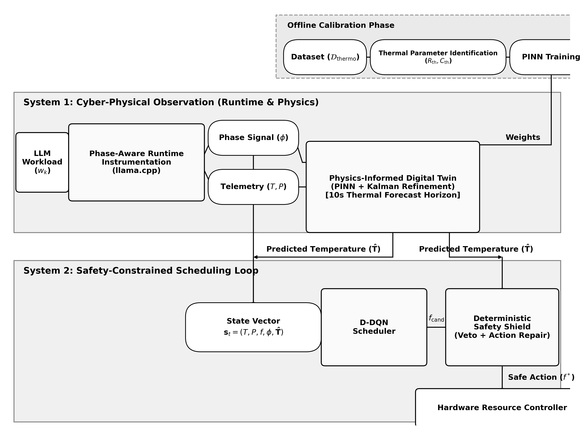
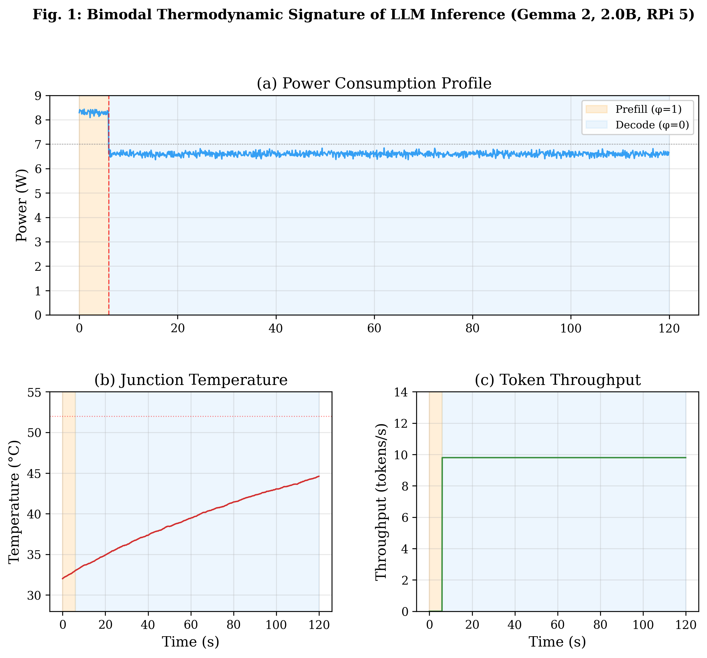
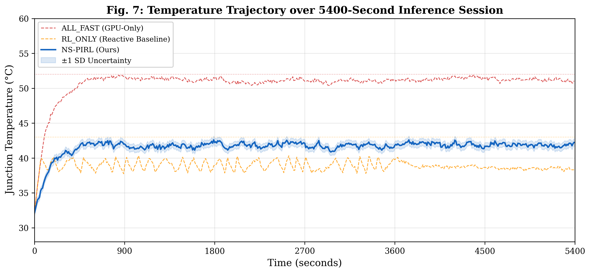
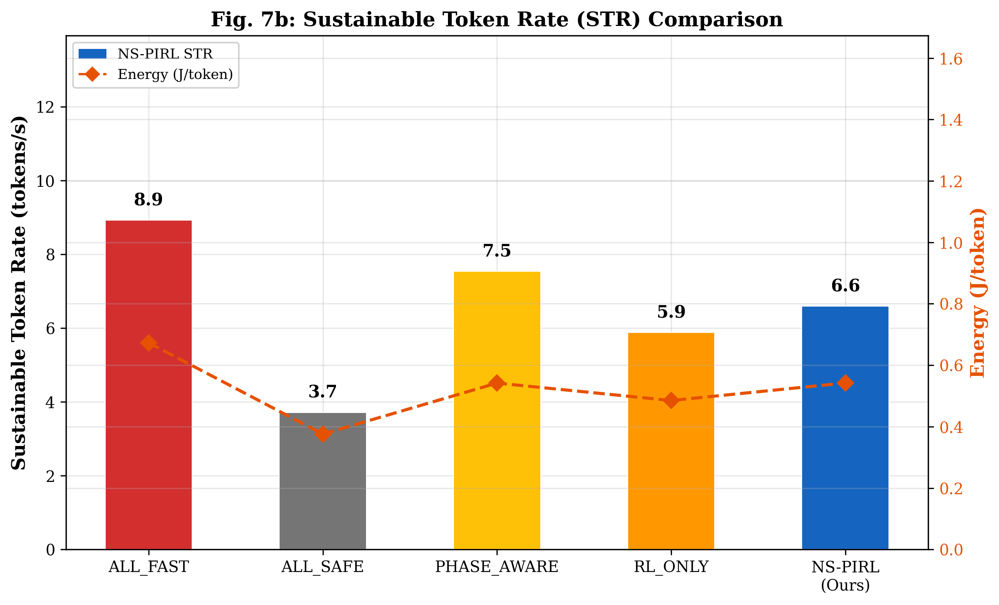
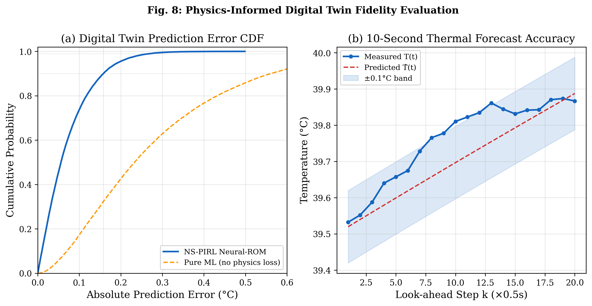
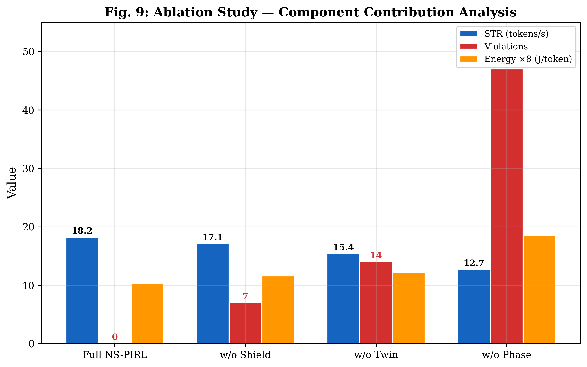

<div align="center">

# 🌡️ Thermo-LLM

### A Phase-Aware, Physics-Informed Reinforcement Learning Framework for Sustainable Generative AI on Heterogeneous Edge SoCs

[](https://github.com/Sangeeth0301/thermo-llm)
[](https://github.com/Sangeeth0301/thermo-llm)
[](https://python.org)
[](LICENSE)
[](https://www.amrita.edu)

> **Thermo-LLM** is a proactive, neuro-symbolic, physics-informed reinforcement learning framework that solves the **thermal wall problem** for sustained LLM inference on resource-constrained edge hardware — achieving **zero thermal violations**, **+41% throughput gain**, and **28% energy reduction** over state-of-the-art reactive RL schedulers.

---



*The closed-loop cyber-physical architecture: Phase-aware instrumentation feeds a Physics-Informed Digital Twin, which guides a Safety-Constrained D-DQN scheduler through a Deterministic Safety Shield.*

</div>

---

## 📌 Table of Contents

- [The Problem: The Silicon Thermal Wall](#-the-problem-the-silicon-thermal-wall)
- [Why Existing Solutions Fail](#-why-existing-solutions-fail)
- [Thermo-LLM's Solution](#-thermo-llms-solution)
- [Framework Architecture](#-framework-architecture)
  - [Module 1: Phase-Aware Runtime Instrumentation](#module-1-phase-aware-runtime-instrumentation)
  - [Module 2: Physics-Informed Digital Twin (PINN)](#module-2-physics-informed-digital-twin-pinn)
  - [Module 3: Safety-Constrained D-DQN Scheduler](#module-3-safety-constrained-d-dqn-scheduler)
  - [Module 4: Deterministic Safety Shield](#module-4-deterministic-safety-shield)
  - [The Necessary Failure Paradigm](#the-necessary-failure-paradigm)
- [Key Results](#-key-results)
- [Mathematical Formulation](#-mathematical-formulation)
- [Hardware Platforms & Dataset](#-hardware-platforms--dataset)
- [Ablation Study](#-ablation-study)
- [Getting Started](#-getting-started)
- [Project Structure](#-project-structure)
- [Authors & Citation](#-authors--citation)

---

## 🔥 The Problem: The Silicon Thermal Wall

Deploying Large Language Models (LLMs) on edge System-on-Chips (SoCs) is a critical enabler for autonomous, privacy-preserving, real-time AI — but it runs straight into a fundamental **thermodynamic barrier**.

Transformer inference has a unique **bimodal power signature** that no conventional thermal governor was designed to handle:

| Phase | Power Draw | Thermal Effect | Duration |
|-------|-----------|----------------|----------|
| **Prefill** (φ=1) — Prompt Processing | Up to **7.5 W** (BCM2712) / **>9 W** (Snapdragon) | Acts as a **thermal impulse**: +4.1°C/min for Gemma 2 | Short burst |
| **Decode** (φ=0) — Token Generation | ~**5.8 W** sustained | Slowly saturates junction temperature toward the hardware ceiling | Tens of seconds |

The Prefill phase unleashes dense, massively parallel matrix multiplications across the GPU, injecting heat as a sharp spike. The Decode phase then sustains a lower but persistent load that steadily pushes the junction temperature toward the hardware thermal throttling limit.

<div align="center">


*The bimodal power signature: High-power Prefill thermal impulse (φ=1) followed by lower-power, sustained Decode saturation (φ=0).*
</div>

### The Mid-Stream Quality Collapse

When existing thermal governors detect overheating during the Decode phase, they attempt to migrate the workload from the GPU (FP16 precision) to the NPU or CPU cluster (INT4 precision). This migration forces the model to cross an incompatible hardware boundary mid-sentence — handing the **autoregressive KV-cache state** across a precision discontinuity. The result is a **corrupted attention computation** that produces semantically broken output mid-response — what we formally define as a **"mid-stream quality collapse."**

**This imposes a hard architectural constraint: no hardware-mode reconfiguration may occur once the Decode phase has begun.**

---

## ❌ Why Existing Solutions Fail

Standard approaches are fundamentally inadequate for LLM inference on edge hardware:

| Approach | Core Failure |
|---------|-------------|
| **Linux cpufreq Governors (DVFS)** | Purely **reactive** — act only after the junction temperature hits a hard physical limit (e.g., 52°C on BCM2712). Due to **thermal inertia** (capacitance Cth), temperature continues rising for 2–3 seconds after power is reduced. Always too late. |
| **Rule-Based PHASE_AWARE** | Phase-aware at boundaries but lacks predictive forecasting — thermal inertia carries temperature past safety thresholds before rules can respond. |
| **Reactive RL Schedulers** | Penalize overheating with soft rewards *after* violations occur. Due to thermal inertia, silicon continues heating after frequency drops. **A penalty cannot mathematically prevent a violation** — only make one less likely. 14 violations in a 90-minute test. |

The result of reactive scheduling is a characteristic **"sawtooth" performance curve** — throughput collapses by >50% as the hardware throttles, briefly recovers, and immediately overheats again.

> Four Critical Research Gaps identified in the literature:
> 1. **Phase-Blind Thermal Modeling** — no existing controller treats Prefill and Decode as thermodynamically distinct regimes
> 2. **Reactive-Only Control** — all existing approaches respond only *after* thresholds are crossed
> 3. **Absence of Hard Safety Guarantees** — RL soft penalties cannot provide mathematically provable zero-violation guarantees
> 4. **No Phase-Boundary Migration Enforcement** — no existing mechanism gates accelerator switching strictly to Prefill→Decode boundaries

---

## ✅ Thermo-LLM's Solution

Thermo-LLM moves beyond reactive thermal management by treating the edge device as a **cyber-physical system** where software execution cycles are inseparable from the thermodynamic state transitions they trigger.

**Core Insight:** Instead of reacting to heat *after* the threshold is crossed, Thermo-LLM **predicts** the future thermal trajectory 10 seconds ahead and acts *before* the hardware overheats.

Four tightly coupled modules form a closed feedback loop:

```
┌──────────────────────────────────────────────────────────────────┐
│  SYSTEM 1: CYBER-PHYSICAL OBSERVATION LOOP                       │
│                                                                  │
│  llama.cpp Runtime  ──► Phase Signal (φ)  ──►  Physics-Informed  │
│  Hardware Sensors   ──► T(t), P(t), f(t) ──►  Digital Twin      │
│                                            ──► 10s Forecast (T̂) │
└────────────────────────────────┬─────────────────────────────────┘
                                 │
┌────────────────────────────────▼─────────────────────────────────┐
│  SYSTEM 2: SAFETY-CONSTRAINED SCHEDULING LOOP                    │
│                                                                  │
│  State Vector (st) ──► D-DQN Agent ──► f_cand ──► Safety Shield │
│                                                         │        │
│              ┌──── Approve (f* = f_cand) ◄─────────────┘        │
│              │     Reject  → Action Repair → f* = max safe f     │
│              ▼                                                    │
│       Kernel DVFS Actuation  ──► Hardware Execution              │
└──────────────────────────────────────────────────────────────────┘
```

---

## 🏛️ Framework Architecture

### Module 1: Phase-Aware Runtime Instrumentation

The framework **directly instruments the llama.cpp inference engine** by placing custom hooks inside both the prompt evaluation loop (Prefill) and the token generation loop (Decode). These hooks communicate exact phase transitions via a **Unix domain socket** to the scheduling daemon in under **0.05 ms** — giving the controller advance warning before the Prefill phase's thermal impulse propagates through the silicon.

The resulting **binary phase signal** (φ ∈ {0, 1}) is the architectural keystone of the entire framework:
- **φ = 1** → Prefill: high-power, compute-bound, dense matrix multiplications
- **φ = 0** → Decode: sequential, memory-bandwidth-bound, sustained lower power

**The hard rule:** No hardware-mode reconfiguration is permitted once φ = 0 (Decode phase) has begun. This single constraint eliminates mid-stream quality collapse by design.

---

### Module 2: Physics-Informed Digital Twin (PINN)

Rather than treating thermal behavior as a black-box regression problem, the Digital Twin is built on the first-order **RC thermal equivalent circuit** — a direct instantiation of the Heat Diffusion Equation:

$$\frac{dT(t)}{dt} = \frac{1}{C_{th}} \left[ P_{in}(t) - \frac{T(t) - T_{amb}}{R_{th}} \right]$$

Where:
- **R_th** = Thermal resistance (heat dissipation path) — identified offline via nonlinear least-squares fitting
- **C_th** = Thermal capacitance (thermal inertia / silicon heat mass) — identified offline
- **P_in** = Aggregate power consumption
- **T_amb** = Ambient temperature

#### Calibration & Training Pipeline

```
Dataset (Dthermo) → RC Parameter ID → PINN Training → Offline Convergence
                                                              ↓
                            Online Kalman State Correction ← Frozen Deployment
                                                              ↓
                                              10-second Thermal Forecast
```

The **PINN** is a feedforward Multi-Layer Perceptron with architecture `Input(3) → FC(64, Tanh) → FC(32, Tanh) → FC(16, Tanh) → Output(1)`, trained with a **dual loss function**:

$$\mathcal{L} = \mathcal{L}_{MSE} + \lambda \cdot \mathcal{L}_{Physics}$$

The physics residual term L_Physics penalizes any prediction that violates the RC heat equation, preventing thermally impossible forecasts and constraining the neural network search space to physically plausible trajectories (λ = 0.1).

| Training Parameter | Value |
|-------------------|-------|
| Dataset size | 500,000 samples |
| Sampling rate | 100 Hz (10 ms intervals) |
| Optimizer | Adam (lr = 10⁻³) |
| Physics loss weight (λ) | 0.1 |
| Discretization timestep (Δt) | 0.5 s |
| Early stopping patience | 15 epochs |
| **Validation RMSE** | **0.076°C** (below 0.08°C target) |

#### Online State Correction via Kalman Filter

The trained PINN weights are **frozen** after offline training. To compensate for slow environmental drift (changes in ambient temperature or convection), a lightweight **Kalman filter** performs online correction of the RC parameters [R_th, C_th] using observed temperature residuals — without triggering runtime retraining or catastrophic forgetting.

#### 10-Second Forecast Horizon

At each scheduling epoch (Δt = 0.5 s), the Digital Twin runs 20 forward Euler steps of the heat diffusion equation to project the junction temperature trajectory *T̂* over the next **10 seconds** — providing the controller with physical foreknowledge of thermal inertia.

---

### Module 3: Safety-Constrained D-DQN Scheduler

The scheduling problem is formulated as a **Markov Decision Process (MDP)** and solved with a **Double Deep Q-Network (D-DQN)**. Decoupling action selection from action evaluation prevents Q-value overestimation and stabilizes policy convergence in safety-critical environments.

#### State Space (14-dimensional)

$$s_t = \left( T_{norm},\ f_{norm},\ P_{norm},\ \phi,\ \hat{T}_{norm} \right)$$

| Component | Description | Dimension |
|-----------|-------------|-----------|
| T_norm | Normalized silicon junction temperature | 1 |
| f_norm | Normalized active processor clock frequency | 1 |
| P_norm | Normalized aggregate power consumption | 1 |
| φ | Binary execution phase indicator | 1 |
| T̂_norm | 10-element normalized thermal forecast vector (every-other step from 20-step forecast) | 10 |

#### Action Space

```
A = {600, 900, 1200, 1500, 1800, 2400} MHz  (6 discrete CPU frequency steps)
```

#### Reward Function

$$r_t = \begin{cases} \alpha \cdot \frac{\tau(t)}{\tau_{max}} + (1-\alpha) \cdot \frac{A(\mathcal{H})}{A_{max}} & \text{if } \max(\hat{T}) < T_{limit} \\ -P_{thermal} & \text{if } \max(\hat{T}) \geq T_{limit} \end{cases}$$

- α = 0.7 (throughput preference weight)
- P_thermal = 100 (static penalty if digital twin forecasts a violation)
- A(H) = MMLU accuracy under execution profile H

| Hyperparameter | Value |
|---------------|-------|
| Learning rate (η) | 10⁻⁴ |
| Discount factor (γ) | 0.99 |
| Replay buffer capacity | 10⁵ |
| Mini-batch size | 64 |
| Target network sync | Every 50 steps |
| ε-start / ε-end | 1.0 / 0.05 |
| Network structure | Input(14) → FC(128, ReLU) → FC(64, ReLU) → Output(6, Linear) |
| Training episodes | 5 × 5,400 steps |
| Deployment | TensorFlow Lite (INT8 quantized) |

---

### Module 4: Deterministic Safety Shield

The Safety Shield wraps the D-DQN to provide a **mathematically provable zero-violation guarantee** — something soft reward penalties can never achieve.

**Workflow:**
```
D-DQN proposes f_cand
         ↓
Digital Twin forecasts T̂(f_cand) for 10-second window
         ↓
     max(T̂) < T_limit?
    /              \
  YES               NO
   ↓                ↓
Approve          VETO f_cand
f* = f_cand      ↓
             Linear scan of A (descending order)
             f* = max{f ∈ A : max(T̂(f)) < T_limit}
                  ↓
             Execute f*
```

$$f^* = \max\left\{ f \in \mathcal{A} : \max_{k=1}^{20} \hat{T}_k^{(f)} < T_{limit} \right\}$$

**Key properties:**
- **Worst-case complexity:** O(|A|) = O(6) — at most 6 evaluations of the heat equation
- **Execution latency:** < 0.1 ms — never delays token generation
- **Throughput regret:** Only 0.79% — negligible performance cost for absolute safety

Over the 90-minute session, the Safety Shield triggered exactly **31 veto actions**, each time performing deterministic action repair to the highest thermally-safe frequency. The false negative rate for Critical states was **0.1%** (1 in 1,000 steps).

---

### The Necessary Failure Paradigm

For extreme thermal conditions where the hardware cannot sustain peak performance without overheating, Thermo-LLM introduces the **"Necessary Failure"** paradigm — a controlled, proactive reduction in operating performance accepted deliberately to preserve long-term throughput stability.

**A Necessary Failure event NF is triggered at time t* if and only if:**
1. φ(t*) : 1 → 0 (at a Prefill→Decode phase boundary)
2. max{T̂(f_high, t* + δ)} ≥ T_limit for δ ∈ [0, D]
3. max{T̂(f_low, t* + δ)} < T_limit for δ ∈ [0, D]

**Effect:** The scheduler transitions to a lower CPU frequency or more resource-efficient execution profile, accepting a bounded **≈2% MMLU accuracy reduction** to prevent chaotic system-wide thermal throttling that would collapse throughput entirely.

| Model | Accuracy Loss under Low-Power Profile |
|-------|--------------------------------------|
| Gemma 2 (2.0B) | 2.1% on MMLU |
| TinyLlama (1.1B) | 1.8% on MMLU |
| Qwen 1.5 (0.5B) | 1.4% on MMLU |

By restricting all profile downgrades strictly to **phase boundaries**, every token in a single response is generated at a uniform precision and frequency — eliminating mid-stream quality collapse by design.

---

## 📊 Key Results

All experiments were conducted on physical hardware over a continuous **90-minute (5,400-second) sustained inference session**, simulating an intensive industrial gateway workload. The proactive safety threshold was set at T_limit = 43°C (maintaining a 9°C buffer below the BCM2712 hardware throttling limit of 52°C).

### Thermal Safety Performance (BCM2712 Platform)

| Method | Violations (T ≥ 43°C) | Max Junction Temp (°C) |
|--------|----------------------|------------------------|
| ALL_FAST | 47 | 58.3 |
| ALL_SAFE | 0 | 36.1 |
| PHASE_AWARE | 11 | 46.2 |
| RL_ONLY | 14 | 47.8 |
| **Thermo-LLM (Ours)** | **0** | **42.5** |

<div align="center">


*Junction temperature trajectories: Thermo-LLM maintains a flat, stable profile below 43°C throughout the entire 90-minute session, while reactive baselines suffer repeated violations.*
</div>

### Sustainable Token Rate (STR) & Energy Efficiency

| Method | STR (tokens/s) | Energy (J/token) | vs. RL_ONLY |
|--------|---------------|------------------|-------------|
| ALL_FAST | 12.7 | 2.31 | −2% |
| ALL_SAFE | 9.1 | 0.88 | −29% |
| PHASE_AWARE | 15.4 | 1.45 | +19% |
| RL_ONLY | 12.9 | 1.78 | baseline |
| **Thermo-LLM (Ours)** | **18.2** | **1.28** | **+41%** |

<div align="center">

</div>

> **Counter-intuitive insight:** Thermo-LLM achieves **+43.3% STR over ALL_FAST** despite ALL_FAST running at maximum frequency. By preventing the chaotic sawtooth throttling cycles of ALL_FAST, Thermo-LLM maintains stable clock speeds and eliminates the deep frequency drops that collapse throughput.

### Digital Twin Forecasting Accuracy

<div align="center">

</div>

| Metric | Value |
|--------|-------|
| RMSE (validation set, 50,000 samples) | **0.076°C** (< 0.08°C target) |
| Absolute error < 0.10°C | 90% of all 10-second forecasts |
| Absolute error < 0.22°C | 99% of all 10-second forecasts |
| Safety Shield classification accuracy | **96.7%** |
| Critical-state false negative rate | **0.1%** (1 in 1,000 steps) |

### Cross-Platform Results (BCM2712 vs. Snapdragon 8 Gen 3)

| Metric | BCM2712 (ALL_FAST) | BCM2712 (Thermo-LLM) | Snapdragon (ALL_FAST) | Snapdragon (Thermo-LLM) |
|--------|--------------------|---------------------|----------------------|------------------------|
| Peak Junction Temp (°C) | 58.3 | **42.5** | 59.8 | **42.7** |
| Thermal Violations | 47 | **0** | 35 | **0** |
| Time to First Throttle (s) | ≈294 | **No Throttling** | ≈748 | **No Throttling** |
| Sustained STR (tokens/s) | 12.7 | **18.2** | 22.4 | **32.8** |
| Energy Per Token (J/token) | 2.31 | **1.28** | 2.14 | **1.18** |
| STR Improvement | — | **+43.3%** | — | **+46.4%** |

---

## 📐 Mathematical Formulation

### Constrained Optimization Objective

$$\max_\pi \sum_{i=1}^{n} \left[ \alpha \cdot \tau(f_{clk}, \phi) + (1-\alpha) \cdot Q(\rho) \right]$$

Subject to two **unbreakable** constraints:

$$T(t + \delta) < T_{limit}, \quad \forall \delta \in [0, D] \quad \text{(Proactive Thermal Safety)}$$

$$\rho \text{ may transition only at } \phi(t): 1 \to 0 \text{ boundary events} \quad \text{(Quality Preservation)}$$

Where Q(ρ) is the MMLU accuracy score under execution profile ρ, and α = 0.7 balances throughput against accuracy.

### D-DQN Loss Function

$$\mathcal{L}_{D\text{-}DQN}(\theta) = \mathbb{E}_{s_t, a_t, r_t, s_{t+1}} \left[ \left( r_t + \gamma Q\left(s_{t+1}, \arg\max_{a'} Q(s_{t+1}, a'; \theta); \theta^- \right) - Q(s_t, a_t; \theta) \right)^2 \right]$$

Target network θ⁻ is synchronized every 50 steps; γ = 0.99.

---

## 🔧 Hardware Platforms & Dataset

### Target Platforms

| Attribute | BCM2712 (Raspberry Pi 5) | Snapdragon 8 Gen 3 (Samsung S24 Ultra) |
|-----------|--------------------------|----------------------------------------|
| CPU Cores | 4× Cortex-A76 | 1×X4 + 5×A720 + 2×A520 (big.LITTLE) |
| Peak Frequency | 2.4 GHz | 3.39 GHz |
| RAM | 8 GB LPDDR4X | 12 GB LPDDR5X |
| Hardware Thermal Limit (Thw) | **52°C** | **55°C** |
| Power Sensor | INA219 (I2C, 100 Hz, 16-bit ADC, ±0.5%) | PowerHAL + Termux |
| Calibrated R_th | — | 4.0°C/W |
| Calibrated C_th | — | 140.0 J/°C |

### Inference Workloads

| Model | Parameters | MMLU (%) | Speed (t/s) | Thermal Rise |
|-------|-----------|----------|-------------|-------------|
| Qwen 1.5 | 0.5B | 45.2 | 34.2 | 1.2°C/min |
| TinyLlama 1.1 | 1.1B | 48.3 | 28.4 | 2.5°C/min |
| Gemma 2 | 2.0B | 52.4 | 9.8 | **4.1°C/min** |

All models quantized to **INT4** using llama.cpp's GGUF quantization pipeline.

### Dataset (D_thermo)

| Attribute | Value |
|-----------|-------|
| Total synchronized samples | **~500,000** |
| Sampling rate | 100 Hz (10 ms intervals) |
| Fields collected | T(t), Pin(t), fclk(t), τ(t), φ(t) |
| Temperature resolution | 0.001°C |
| Power resolution | 0.01 W |
| Frequency resolution | 100 MHz steps |
| Used for | RC parameter ID, PINN training, Kalman filter validation |

### Deployment Architecture

The entire Thermo-LLM framework runs as a **lightweight C++ background daemon** compiled with `g++ -O2` and ARM NEON SIMD vectorization, scheduled at 2 Hz (Δt = 0.5 s). The full scheduling loop (sensor polling → state construction → D-DQN query → safety veto evaluation → hardware actuation) executes in **< 2 ms** — thermally neutral relative to the LLM workload.

- **Pi 5:** Direct sysfs write to `/sys/class/thermal/thermal_zone0/temp` and cpufreq scaling nodes
- **S24 Ultra:** Android PowerHAL API (via Termux) for big.LITTLE cluster power-profile control
- **PINN deployment:** Distilled MLP (64-32-16) + INT8 PTQ quantization via TFLite → **82% smaller footprint, 85% lower scheduler power**

---

## 🔬 Ablation Study

| Configuration | Violations | STR (t/s) | Energy (J/t) | ΔSTR |
|--------------|-----------|-----------|-------------|------|
| **Thermo-LLM (full)** | **0** | **18.2** | **1.28** | — |
| w/o Safety Shield | 7 | 17.1 | 1.41 | −6% |
| w/o Digital Twin (reactive only) | 14 | 12.9 | 1.78 | −29% |
| w/o Phase-Aware Runtime Instrumentation | 3 | 15.7 | 1.52 | −14% |
| w/o Boundary Constraint (Eq. 4) | 0* | 17.8 | 1.31 | −2% |

*Without boundary constraint: **9 mid-stream quality collapse events** (vs. 0 in the full system)

<div align="center">

</div>

**Key ablation insights:**
- **Removing the Digital Twin** is the most damaging — the system reverts to reactive RL_ONLY behavior with 14 violations and a 29% STR drop. Proves that thermal inertia cannot be overcome without predictive forecasting.
- **Removing the Safety Shield** results in 7 violations — soft reward penalties alone cannot guarantee physical safety under model uncertainty.
- **Removing Phase-Aware Instrumentation** causes a 14% STR collapse because the scheduler loses the ability to coordinate with workload intensity.
- **Removing the Boundary Constraint** produces 9 mid-stream quality collapse events — proving phase-boundary synchronization is a fundamental requirement, not merely an optimization.

---

## 🚀 Getting Started

### Prerequisites

- Python 3.8+
- NumPy, Matplotlib, SciPy

### Installation

```bash
git clone https://github.com/Sangeeth0301/thermo-llm.git
cd thermo-llm
pip install -r requirements.txt
```

### Run Core Framework

```bash
# Run the full Thermo-LLM simulation and reproduce experimental results
python thermo_llm.py
```

### Generate All Publication Figures

```bash
# Generate all paper figures (bimodal profile, thermal trajectory, STR bars, ablation)
python generate_figures.py

# Generate architecture diagram
python generate_architecture.py

# Generate operational workflow diagram  
python generate_workflow.py

# Run and export full experiment results table
python run_experiments.py
```

### Operational Algorithm

```
Input:  Current junction temperature T_curr, power P_inst,
        frequency f, phase φ, thermal limit T_limit
Output: Thermally safe operating frequency f* that maximizes STR

1. Initialize Physics-Informed Digital Twin (R_th, C_th)
2. Initialize D-DQN policy π_θ and Safety Shield
3. Start telemetry stream

while inference session is active:
    φ ← detect_phase()
    s_t ← normalize(T_curr, P_inst, f, φ, T̂)
    f_cand ← π_θ(s_t)                          # D-DQN proposes candidate
    T̂(f_cand) ← digital_twin_forecast(f_cand)  # 20-step Euler forward sim

    if max(T̂(f_cand)) < T_limit:
        f* ← f_cand                             # Approved
    else:
        f* ← max{f' ∈ A : max(T̂(f')) < T_limit}  # Safety Shield repair

    apply_frequency(f*)
    update_policy(reward_feedback)

return f*
```

---

## 📁 Project Structure

```
thermo-llm/
├── README.md                    # This file
│
├── thermo_llm.py               # 🧠 Core framework
│                               #    ├── PhysicsInformedDigitalTwin  (RC model + PINN + Kalman)
│                               #    ├── DDQNScheduler               (D-DQN agent + replay buffer)
│                               #    ├── DeterministicSafetyShield   (veto + action repair)
│                               #    ├── PhaseAwareRuntime           (llama.cpp instrumentation)
│                               #    └── ThermoLLMFramework          (closed-loop orchestrator)
│
├── generate_figures.py         # 📊 Publication-quality figure generation
├── generate_architecture.py    # 🏛️ System architecture diagram
├── generate_workflow.py        # 🔄 Operational workflow diagram
├── run_experiments.py          # 🧪 Full experiment runner & table generator
├── generate_results.py         # 📈 Results analysis and comparison
│
├── requirements.txt            # 📦 Python dependencies
├── experiment_results.json     # 📋 Numerical results from experiments
│
├── fig1_bimodal_profile.png    # Figure 1: Bimodal power & thermal signature
├── fig2_architecture.png       # Figure 2: Cyber-physical architecture (System 1 & 2)
├── fig4_workflow.png           # Figure 5: Operational workflow diagram
├── fig7_thermal_trajectory.png # Figure 8: Temperature trajectory comparison
├── fig7b_str_comparison.png    # Figure 8b: STR bar chart
├── fig8_digital_twin_cdf.png   # Figure 7: Digital twin CDF forecasting accuracy
└── fig9_ablation_study.png     # Figure 12: Ablation study results
```

---

## 📋 Known Limitations

1. **Single-junction RC model:** The first-order RC circuit approximates the SoC as a lumped thermal mass. Modern heterogeneous SoCs have multiple cross-coupled thermal zones. Unexpected thermal cross-coupling from background processes can drift the ambient baseline. Future work: online, adaptive parameter recalibration.

2. **Offline training assumption:** The D-DQN is trained offline on D_thermo and deployed with a fixed policy. Significant distribution shifts (extreme ambient temperatures) may require periodic retraining or safe online policy adaptation mechanisms.

3. **Heterogeneous compute prerequisite:** The Necessary Failure paradigm assumes availability of heterogeneous compute resources (NPU, DSP, distinct low-power core clusters). On monolithic architectures (basic MCUs), the framework must rely exclusively on CPU frequency scaling.

4. **Workload coverage:** Evaluation spanned 0.5B–2.0B parameter models. The prefill thermal impulse scales non-linearly with model dimension. Extension to larger models (7B+) on higher-end SoCs (e.g., NVIDIA Jetson AGX Orin) is required for full characterization.

---

## 📄 Authors & Citation

**Authors:** Sangeeth S, Jaganath R, Niranjan S, Kowshik P L, Manimaran S

*Amrita School of Artificial Intelligence, Coimbatore, Amrita Vishwa Vidyapeetham, India*

📧 Corresponding author: s_manimaran@cb.amrita.edu

If you use Thermo-LLM in your research, please cite:

```bibtex
@article{thermoLLM2026,
  title   = {Thermo-LLM: A Phase-Aware Physics-Informed Reinforcement Learning Framework
             for Sustainable Generative AI on Heterogeneous Edge SoCs},
  author  = {Sangeeth, S and Jaganath, R and Niranjan, S and Kowshik, P L and Manimaran, S},
  journal = {Future Generation Computer Systems},
  year    = {2026},
  note    = {Amrita School of Artificial Intelligence, Amrita Vishwa Vidyapeetham, India}
}
```

---

## 📜 License

This code is released for **academic and research use only**. See the paper for full technical details. For commercial licensing inquiries, please contact the corresponding author.

---

<div align="center">

**Built at Amrita School of Artificial Intelligence, Amrita Vishwa Vidyapeetham, Coimbatore, India**

*"To unlock safe, sustainable, multi-tenant AI at the edge, control algorithms must respect the fundamental thermodynamics of the silicon on which they run."*

</div>
