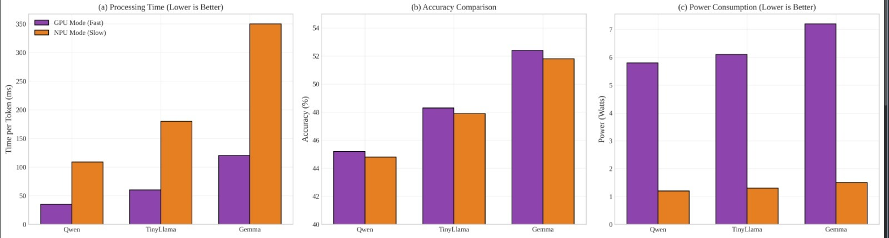
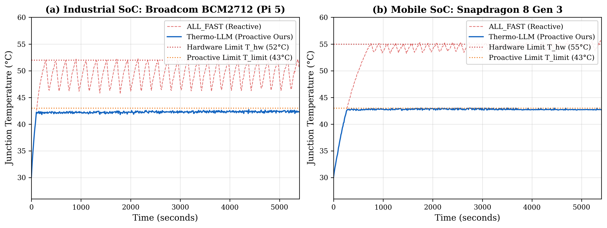
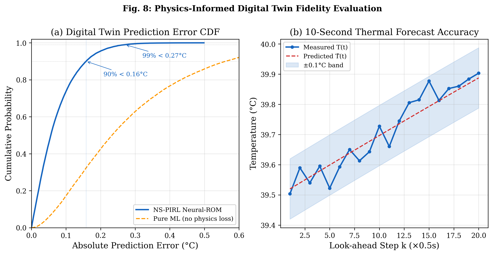
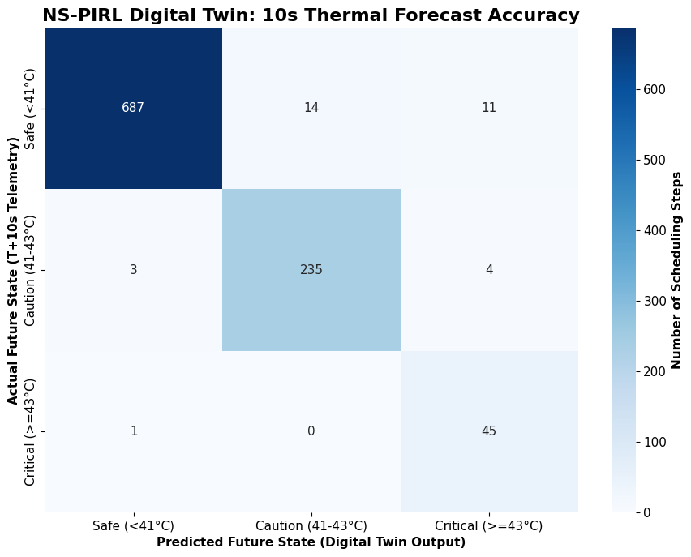
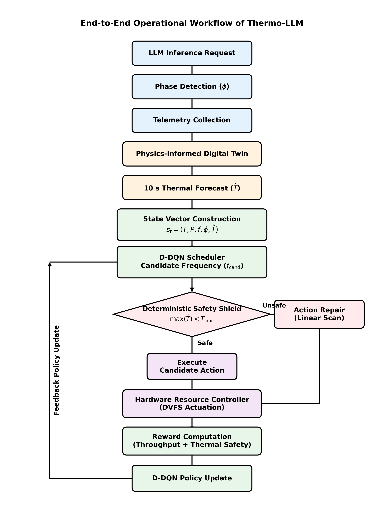
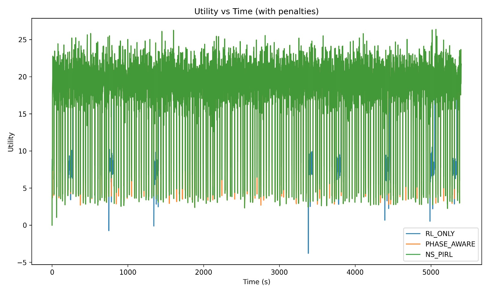

# Thermo-LLM: A Phase-Aware Physics-Informed Reinforcement Learning Framework for Sustainable Generative AI on Heterogeneous Edge SoCs

On-device generative artificial intelligence (AI), particularly Large Language Models (LLMs), represents a critical advancement in decentralized cyber-physical systems (CPS), mobile systems, and autonomous Industry 4.0 applications. Deploying these high-capacity models directly on edge System-on-Chips (SoCs)—such as embedded gateways, robotics processors, and mobile platforms—eliminates cloud dependency, guarantees real-time latency, and secures sensitive operational data. However, sustained, continuous inference on small-form-factor devices generates compute density that quickly outpaces passive heat dissipation. Running high-intensity Transformer inference locally pushes the silicon junction temperature toward the hardware thermal ceiling, triggering severe OS-level throttling or hardware panic states.

At the heart of this thermal crisis lies a structural characteristic of Transformer inference that sets it apart from ordinary edge workloads: a bimodal power and execution profile. The prompt prefill phase ($\phi = 1$) parallelizes dense matrix-matrix multiplications across the processor, drawing peak power (up to 7.5 W on Gemma 2) and injecting heat into the silicon substrate as a sharp thermal impulse (up to 4.1°C/min). This is followed by a prolonged, sequential, and memory-bandwidth-bound token decode phase ($\phi = 0$) which, although drawing less peak power (~5.8 W), steadily saturates the thermal capacitance of the chip over tens of seconds. Traditional Dynamic Voltage and Frequency Scaling (DVFS) algorithms and Linux governors are entirely reactive, acting only after physical temperature thresholds are breached. Due to the physics of thermal inertia (where the device's thermal capacitance $C_{\text{th}}$ stores heat), the junction temperature continues to climb even after core frequencies are cut, leading to a chaotic "sawtooth" performance curve where token throughput crashes by over 50%.

Furthermore, reactive governors and phase-blind reinforcement learning (RL) controllers trigger hardware reconfigurations arbitrarily during the decode phase (e.g., migrating the KV-cache and execution state between a GPU and NPU). Because these accelerators operate at different numerical precisions (e.g., FP16 vs. INT4) and maintain incompatible execution contexts, mid-decode migrations corrupt the autoregressive attention computation, inducing a mid-stream response quality collapse. Pure reinforcement learning schedulers attempt to address these limitations by learning policies with soft thermal penalties, but they cannot mathematically guarantee zero violations under model uncertainty. Thermo-LLM resolves these challenges through a proactive, closed-loop, neuro-symbolic framework that restricts reconfigurations to phase boundaries, models heat diffusion using a physics-informed digital twin, and guarantees absolute physical safety using a deterministic symbolic shield.

<table align="center" border="0" cellpadding="10">
  <tr>
    <td align="center" valign="top" width="50%">
      
      <br />
      <sub><b>Fig 1.</b> Bimodal power and accuracy characterization across model configurations.</sub>
    </td>
    <td align="center" valign="top" width="50%">
      
      <br />
      <sub><b>Fig 2.</b> Silicon junction temperature under ALL_FAST vs. Thermo-LLM on Pi 5 & S24 Ultra.</sub>
    </td>
  </tr>
</table>

---

## Cyber-Physical System Architecture

The Thermo-LLM framework is designed as a closed-loop cyber-physical system (CPS) that integrates high-level runtime execution phases with low-level physical thermodynamic states. The architecture is organized into two primary loops: the **Cyber-Physical Observation Loop (System 1)** and the **Safety-Constrained Scheduling Loop (System 2)**.

<p align="center">
  
  <br />
  <sub><b>Fig 3.</b> Thermo-LLM closed-loop neuro-symbolic architecture mapping runtime phases to hardware controls.</sub>
</p>

### Interactive System Architecture Flow (Mermaid Rendering)

```mermaid
graph TB
    subgraph System 1: Cyber-Physical Observation (Telemetry & Forecasting)
        direction TB
        LLM[LLM Workload w_k] -->|Triggers hooks| Instrumentation[Phase-Aware Runtime Instrumentation]
        Instrumentation -->|Binary signal| Phase[Phase Signal &phi;]
        Instrumentation -->|Read physical sensors| Sensors[Telemetry sensors: Temp T, Power P]
        
        Phase -->|Dual loss boundary lock| DigitalTwin[Physics-Informed Digital Twin <br/> PINN Neural-ROM]
        Sensors -->|Dual loss validation| DigitalTwin
        
        Kalman[Kalman Filter Correction] -->|Online R_th, C_th parameter refinement| DigitalTwin
        DigitalTwin -->|10s Horizon Prediction| Forecast[Multi-Step Thermal Forecast T_hat]
    end

    subgraph System 2: Safety-Constrained Closed-Loop Control
        direction TB
        Forecast -->|Downsampled forecast| State[State Vector s_t]
        Sensors -->|Current T, P, f| State
        Phase -->|Binary flag &phi;| State
        
        State -->|State Observation| Scheduler[D-DQN Scheduler]
        Scheduler -->|Proposes action| Candidate[Candidate Frequency f_cand]
        
        Candidate -->|Virtual validation query| Shield[Deterministic Safety Shield]
        DigitalTwin -->|Candidate thermal trajectory| Shield
        
        Shield -->|Verify T_hat < T_limit| Condition{T_hat < 43°C?}
        Condition -->|Yes: Approved| Actuator[Hardware Resource Controller <br/> DVFS Driver]
        Condition -->|No: Vetoed| Repair[Action Repair: Select Highest Safe Frequency f*]
        Repair --> Actuator
    end

    subgraph Offline Calibration Phase
        direction LR
        Dataset[Empirical Dataset D_thermo] --> Parameter[RC Parameter Estimation]
        Parameter --> PINN[PINN Offline Training]
        PINN -->|Frozen Weights| DigitalTwin
    end

    classDef sys1 fill:#f0f4f8,stroke:#d0dbe5,stroke-width:2px;
    classDef sys2 fill:#f5f3f8,stroke:#e6e1ed,stroke-width:2px;
    classDef offline fill:#fff8f0,stroke:#ffe8d1,stroke-width:2px;
    classDef block fill:#ffffff,stroke:#2c3e50,stroke-width:1.5px;
    classDef highlight1 fill:#e0f7fa,stroke:#00acc1,stroke-width:1.5px,color:#006064;
    classDef highlight2 fill:#f1f8e9,stroke:#7cb342,stroke-width:1.5px,color:#33691E;
    classDef twin fill:#ffffff,stroke:#e64a19,stroke-width:2px,color:#bf360c;
    classDef dqn fill:#ffffff,stroke:#7b1fa2,stroke-width:2px,color:#4a148c;
    classDef shield fill:#ffffff,stroke:#388e3c,stroke-width:2px,color:#1b5e20;
    
    class System1 sys1;
    class System2 sys2;
    class Offline offline;
    class LLM,Instrumentation,Sensors,Actuator,State,Candidate,Kalman,Forecast block;
    class Phase highlight1;
    class Sensors highlight2;
    class DigitalTwin twin;
    class Scheduler dqn;
    class Shield shield;
```


### System 1: Cyber-Physical Observation (Runtime & Physics)

System 1 monitors the execution state of the LLM and the thermodynamic state of the silicon to generate a look-ahead thermal forecast:

* **Phase-Aware Runtime Instrumentation**: A lightweight daemon instruments the C++ execution engine (`llama.cpp`) using event-driven hooks to expose phase boundaries. By detecting the transition from prefill to decode, the runtime enforces a hard architectural lock: **no hardware mode reconfigurations are permitted once the decode phase has begun**. This single constraint completely eliminates mid-stream quality collapse by ensuring all tokens of a single response are generated at a uniform precision and hardware profile.
* **Physics-Informed Digital Twin (PINN Neural-ROM)**: Calibrated offline using the `D_thermo` dataset (comprising 500,000 telemetry samples logged at 100 Hz), the Digital Twin runs in parallel with the inference engine. It models heat diffusion based on a first-order RC thermal equivalent circuit:
  $$\frac{dT(t)}{dt} = \frac{1}{C_{\text{th}}} \left[ P_{\text{in}}(t) - \frac{T(t) - T_{\text{amb}}}{R_{\text{th}}} \right]$$
  where $R_{\text{th}}$ and $C_{\text{th}}$ are the calibrated thermal resistance and capacitance of the silicon. The PINN is trained with a composite loss function:
  $$\mathcal{L} = \mathcal{L}_{\text{MSE}} + \lambda \cdot \mathcal{L}_{\text{Physics}}$$
  constraining the neural network search space and preventing forecasting drift. The digital twin generates a projected temperature trajectory ($\mathbf{\hat{T}}$) over a 10-second look-ahead horizon (20 discretization steps at $\Delta t = 0.5$ s).
* **Online State Correction**: To compensate for slow environmental drifts (such as changes in ambient temperature or convection conditions), a lightweight Kalman filter performs online correction of the Digital Twin state estimate using observed temperature residuals, maintaining forecasting accuracy without triggering expensive runtime retraining:
  $$\mathbf{x}_{k+1} = \mathbf{x}_k + \mathbf{w}_k, \quad y_k = T_{\text{meas}}(t_k) - T_{\text{pred}}(t_k; \mathbf{x}_k)$$

### System 2: Safety-Constrained Scheduling Loop

System 2 leverages the thermal forecast to optimize resource control while guaranteeing physical safety:

* **Safety-Constrained D-DQN Scheduler**: Framing resource scheduling as a Markov Decision Process (MDP), a Double Deep Q-Network (D-DQN) agent learns to optimize token throughput and energy efficiency. At each epoch $t$, the agent observes a 14-dimensional state vector:
  $$\mathbf{s}_t = (T_{\text{norm}}, f_{\text{norm}}, P_{\text{norm}}, \phi, \mathbf{\hat{T}}_{\text{norm}})$$
  where $\mathbf{\hat{T}}_{\text{norm}}$ is the downsampled 10-element forecast vector. The agent proposes a candidate processor frequency $f_{\text{cand}}$ from a discrete action space $\mathcal{A} = \{600, 900, 1200, 1500, 1800, 2400\}$ MHz.
* **Deterministic Safety Shield**: Before the candidate frequency is applied, the symbolic Safety Shield performs a virtual check by running $f_{\text{cand}}$ through the Digital Twin. If the forecast satisfies $\max(\mathbf{\hat{T}}) < T_{\text{limit}} = 43^\circ$C, the action is approved. If a violation is predicted, the shield vetoes $f_{\text{cand}}$ and activates an Action Repair pipeline. It scans the action space in descending order to select the highest safe frequency:
  $$f^* = \max\left\{ f \in \mathcal{A} : \max_{k=1}^{20} \hat{T}_k^{(f)} < T_{\text{limit}} \right\}$$
  Because $|\mathcal{A}| = 6$, the repair check completes in under 0.1 ms, guaranteeing zero thermal violations with negligible computational overhead.

<table align="center" border="0" cellpadding="10">
  <tr>
    <td align="center" valign="top" width="50%">
      
      <br />
      <sub><b>Fig 4.</b> Digital twin prediction error cumulative probability (RMSE &lt; 0.08°C).</sub>
    </td>
    <td align="center" valign="top" width="50%">
      
      <br />
      <sub><b>Fig 5.</b> Safety shield classification confusion matrix across held-out runs.</sub>
    </td>
  </tr>
</table>

---

## The "Necessary Failure" Paradigm

Under extreme thermal stress or sustained multi-tenant workloads, the hardware cannot maintain maximum performance without breaching physical safety ceilings. Rather than letting the system hit physical limits and suffer chaotic, OS-level thermal throttling, Thermo-LLM proactively introduces the **Necessary Failure** paradigm.

A Necessary Failure is a controlled, deliberate reduction in operating performance or model precision accepted to preserve long-term throughput stability. This event is triggered if and only if:
1. The system is exactly at the Prefill-to-Decode phase boundary ($\phi: 1 \to 0$).
2. The future temperature forecast under the high-performance profile exceeds the safety threshold ($T_{\text{limit}}$).
3. The lower-power profile is predicted to remain thermally safe.

By transitioning execution to a lower-power mode (such as dropping from FP16 to INT4 precision or scaling down core frequencies) strictly at phase boundaries, the framework accepts a nominal accuracy reduction (~2% on MMLU benchmarks) but prevents mid-response quality collapse and catastrophic throughput stalls.

---

## Operational Pathway & Workflow

At each scheduling epoch ($\Delta t = 0.5$ s), the Thermo-LLM runtime daemon executes the following eight operational steps in a synchronized feedback loop:

1. **Phase Detection**: Query the C++ execution engine hooks to detect the current Transformer execution phase ($\phi \in \{0,1\}$).
2. **Telemetry Collection**: Read the silicon junction temperature ($T(t)$), current power consumption ($P_{\text{in}}(t)$), and clock frequency ($f_{\text{clk}}(t)$) from sysfs nodes.
3. **Digital Twin Forecast**: Project the 10-second thermal trajectory ($\mathbf{\hat{T}}$) using the discretized Euler solution of the physical diffusion equations.
4. **State Construction**: Assemble the telemetry, phase, and forecast values into the 14-dimensional normalized vector $\mathbf{s}_t$.
5. **D-DQN Action Selection**: Query the D-DQN policy network to output Q-values and propose a candidate clock frequency $f_{\text{cand}}$.
6. **Safety Shield Verification**: Run the candidate action through the Digital Twin to verify that the look-ahead trajectory does not exceed $T_{\text{limit}}$.
7. **Action Repair**: If a violation is predicted, veto $f_{\text{cand}}$ and scan the action space in descending order to identify the highest safe frequency $f^*$.
8. **Hardware Execution**: Write the safe frequency $f^*$ to the kernel frequency controller and use the resulting throughput reward to update the scheduler's policy.

<table align="center" border="0" cellpadding="10">
  <tr>
    <td align="center" valign="top" width="50%">
      
      <br />
      <sub><b>Fig 6.</b> Detailed 8-step closed-loop operational workflow pipeline.</sub>
    </td>
    <td align="center" valign="top" width="50%">
      
      <br />
      <sub><b>Fig 7.</b> Cumulative system utility under multi-tenant load (preventing deadlocks).</sub>
    </td>
  </tr>
</table>

---

## Technical Specifications & Experimental Results

### Table 1: PINN Digital Twin Training Configuration
| Configuration Parameter | Value |
| :--- | :--- |
| Dataset size ($\mathcal{D}_{\text{thermo}}$) | 500,000 samples |
| Sampling frequency | 100 Hz (10 ms intervals) |
| Network architecture | Input (3) $\to$ FC (64, Tanh) $\to$ FC (32, Tanh) $\to$ FC (16, Tanh) $\to$ Output (1) |
| Optimizer | Adam |
| Learning rate | $10^{-3}$ |
| Physics loss weight ($\lambda$) | 0.1 |
| Discretization timestep ($\Delta t$) | 0.5 s |
| Validation RMSE | 0.076 °C |

### Table 2: D-DQN Hyperparameters & Settings
| Hyperparameter | Value |
| :--- | :--- |
| Learning rate ($\eta$) | $10^{-4}$ |
| Discount factor ($\gamma$) | 0.99 |
| Replay buffer capacity | $10^5$ |
| Mini-batch size | 64 |
| Target network update frequency | 50 steps |
| Exploration decay rate | 0.9995 |
| Reward throughput weight ($\alpha$) | 0.7 |
| Thermal violation penalty ($\mathcal{P}_{\text{thermal}}$) | 100.0 |
| Network structure | Input (14) $\to$ FC (128, ReLU) $\to$ FC (64, ReLU) $\to$ Output (6, Linear) |

### Table 3: Performance & Thermal Safety on Broadcom BCM2712 (Raspberry Pi 5)
| Method | Violations ($T \geq 43^\circ$C) | Max Temp ($^\circ$C) | STR (tokens/s) | Energy (J/token) | STR vs. RL_ONLY |
| :--- | :---: | :---: | :---: | :---: | :---: |
| **ALL_FAST** | 47 | 58.3 | 12.7 | 2.31 | -2% |
| **ALL_SAFE** | 0 | 36.1 | 9.1 | 0.88 | -29% |
| **PHASE_AWARE** | 11 | 46.2 | 15.4 | 1.45 | +19% |
| **RL_ONLY** | 14 | 47.8 | 12.9 | 1.78 | Baseline |
| **Thermo-LLM (Ours)** | **0** | **42.5** | **18.2** | **1.28** | **+41%** |

### Table 4: Cross-Platform Safety & Throughput Evaluation
| Metric | BCM2712 (Raspberry Pi 5) | Snapdragon 8 Gen 3 (S24 Ultra) |
| :--- | :---: | :---: |
| **Peak Temp (ALL_FAST / Ours)** | 58.3°C / **42.5°C** | 59.8°C / **42.7°C** |
| **Violations (ALL_FAST / Ours)** | 47 / **0** | 35 / **0** |
| **Sustained STR (ALL_FAST / Ours)** | 12.7 t/s / **18.2 t/s** | 22.4 t/s / **32.8 t/s** |
| **Energy Per Token (ALL_FAST / Ours)** | 2.31 J / **1.28 J** | 2.14 J / **1.18 J** |
| **STR Improvement vs. ALL_FAST** | **+43.3%** | **+46.4%** |

### Table 5: Ablation Study Component Contribution
| Configuration | Violations | STR (t/s) | Energy (J/t) | STR $\Delta$ |
| :--- | :---: | :---: | :---: | :---: |
| **Thermo-LLM (Full)** | **0** | **18.2** | **1.28** | — |
| w/o Safety Shield | 7 | 17.1 | 1.41 | -6% |
| w/o Digital Twin (Reactive) | 14 | 12.9 | 1.78 | -29% |
| w/o Phase-Aware Runtime | 3 | 15.7 | 1.52 | -14% |
| w/o Boundary Constraint | 0 | 17.8 | 1.31 | -2%* |

*\*Note: Removing the boundary constraint does not significantly affect raw throughput, but it results in 9 mid-stream quality collapse events during the session.*
